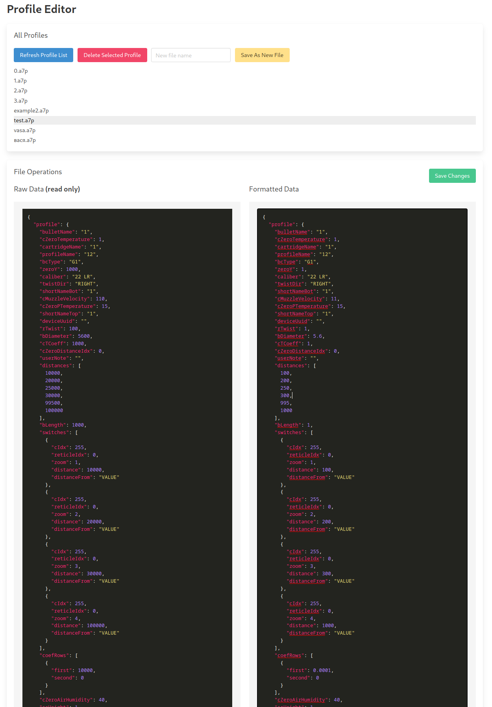

# Table of Contents

- [Project Overview](#project-overview)
- [How to Build the Project](#how-to-build-the-project)
- [How to Run the Project](#how-to-run-the-project)
- [Dockerfile](#dockerfile)
- [Makefile](#makefile)
- [main.go](#maingo)
- [main.js](#mainjs)
- [index.html](#indexhtml)
- [python3 module](python/README.md)



## Project Overview

This project is a web-based Profile Editor application that allows users to manage `.a7p` files. It uses a Docker-based Go application for the server-side logic, a JavaScript file for the client-side logic, and an HTML file for the user interface. The application provides functionalities for listing, retrieving, creating, and deleting `.a7p` files.

Here is a diagram of the project structure:




## How to Build the Project

To build the project, you need to have Docker installed on your machine. Once Docker is installed, you can use the `Makefile` to build the Docker image of the Go application. The `Makefile` includes a `build` target that builds the Docker image. You can build the Docker image by running the following command in the terminal:

```bash
make build
```

This command builds the Docker image and tags it as `go-server`.

## How to Run the Project

To run the project, you can use the `Makefile` to run the Docker container from the `go-server` image. The `Makefile` includes a `run` target that runs the Docker container. You can run the Docker container by running the following command in the terminal:

```bash
make run
```

This command runs the Docker container in an interactive terminal mode and uses the host network. It also mounts the `data` directory from the current working directory on the host to the `/data` directory inside the container. This `data` directory contains `.a7p` files that the user can interact with.

## Dockerfile

The Dockerfile is part of a multi-stage build process that creates an application using Golang, Protobuf, Node.js, and Java. It compiles protobuf files, builds a Go application, and generates JavaScript workers using shadow-cljs. The final executable image is based on Ubuntu.

## Makefile

The `Makefile` is a build automation tool that aids in managing and maintaining the Docker-based Go application. It defines two primary targets: `build` and `run`, which are designed to streamline the process of building and running the application. The `data` directory, which contains `.a7p` files that the user can interact with, is mounted from the current working directory on the host to the `/data` directory inside the container.

## main.go

The `main.go` file is the main entry point for a Go application that serves as a local server for handling and managing `.a7p` files. The application provides functionalities for listing, retrieving, creating, and deleting these files. It uses Google's Protocol Buffers (protobuf) for data serialization and deserialization.

## main.js

The `main.js` file is a client-side JavaScript script that interfaces with the server-side Go application for the management of `.a7p` files. It furnishes a user interface that allows for the listing, retrieval, creation, and deletion of these files. Additionally, it employs Web Workers to facilitate the transformation of data between its raw form (a direct translation from protobuf) and the in-editor format that users interact with.

## index.html

The `index.html` file serves as the main HTML document for a web-based Profile Editor application. It provides a user interface for managing `.a7p` files, allowing users to list, retrieve, create, and delete these files. It also provides an interface for viewing and editing the content of these files.
